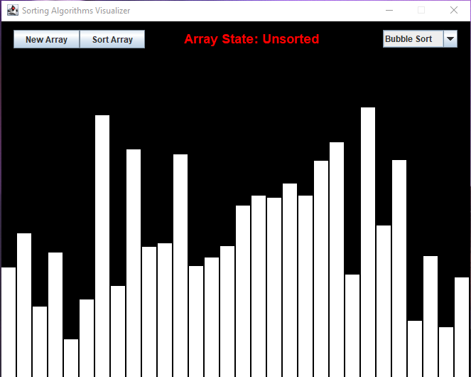
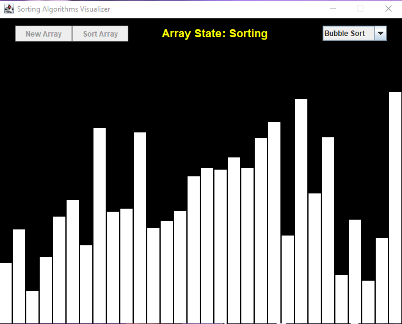
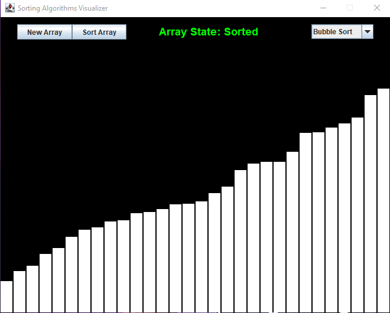

# SortingAlgorithmVisualizer
The goal of the project was to create a GUI sorting algorithm visualizer which used the MVC and Observer design patterns. The GUI was created using java swing and allows users to visualize Bubble sort, Merge Sort, and Insertion sort.  
---

---
Steps to run the Visualizer:
1. Download the project zip file.
2. Extract the zip file.
3. Navigate to the directory containing the extracted zip file using the command line.
4. Execute the JAR file on the command line using the following: java -jar SortingAlgorithmVisualizer.jar
